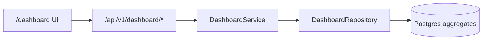

# Dashboard Architecture

## Overview

The VoxForge Dashboard provides org-scoped analytics and a web UI for monitoring voice AI operations.

## Web UI

Open **http://localhost:8000/dashboard** after starting the server.

1. Register or log in with email/password (HttpOnly cookie session)
2. JWT paste stays under **Advanced** for API debugging only
3. View overview, sessions, replay, latency, evaluations, and activity

Static assets live in `dashboard/` at the project root.

Conversation replay details: [replay.md](replay.md).

## API Endpoints

| Method | Path | Description |
|--------|------|-------------|
| GET | `/api/v1/dashboard/overview` | Org-level KPIs |
| GET | `/api/v1/dashboard/sessions` | Recent sessions with stats |
| GET | `/api/v1/dashboard/latency` | Latency breakdown by metric |
| GET | `/api/v1/dashboard/evaluations` | Evaluation pass/warn/fail summary |
| GET | `/api/v1/dashboard/activity` | Recent sessions, tools, evaluations |
| GET | `/api/v1/dashboard/outcomes` | Task success / escalation / resolution KPIs (+ trend) |
| GET | `/api/v1/dashboard/alerts` | Active regression alerts vs template thresholds |

All endpoints require JWT with `sessions:read` scope.

## Data Sources

Aggregates from existing tables:
- `voice_sessions`, `messages`, `session_metrics`
- `tool_calls`, `evaluation_runs`, `evaluation_metrics`
- `outcome_kpis`

See also [outcomes.md](outcomes.md) for the write path and trend window behavior.
