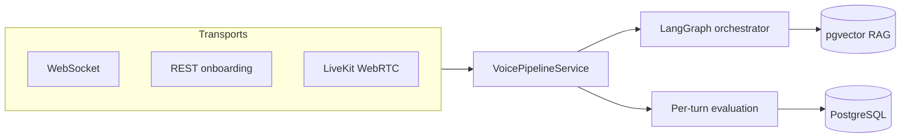

# VoxForge — Case Study

**Role:** Solo founder / principal engineer  
**Stack:** Python 3.12, FastAPI, LangGraph, PostgreSQL/pgvector, Redis, Docker, LiveKit  
**Live:** [voxforge.brohammad.tech](https://voxforge.brohammad.tech) · [GitHub](https://github.com/Brohammad/VoxForge)

---

## Problem

Teams evaluating voice AI hit a gap: **managed SaaS** (Vapi, Retell) is fast but opaque and metered; **DIY frameworks** (LiveKit Agents, Pipecat) stop at the LLM call with no ops story. Neither ships evaluation, replay, handoff, knowledge ingestion, and self-hosted HTTPS deployment as one product.

I built VoxForge to prove I can ship **customer-shaped infrastructure** — not a chatbot demo.

---

## Solution

A modular-monolith voice platform: one codebase, one Docker deploy, clear module boundaries.

Every transport calls the same pipeline. Mock providers run CI and public demo without API keys; real Deepgram/OpenAI/Cartesia swap in via env vars.

---

## What I shipped (post–RC-1 hardening)

| Area | Deliverable |
|------|-------------|
| **Auth** | HttpOnly cookie sessions, CSRF, register/invite/API keys in dashboard |
| **Voice** | Active agent config wired into live sessions (prompt + orchestrator mode) |
| **Demo** | Browser TTS via `/demo/speak`, provider badges, automated GIF capture |
| **Knowledge** | List/delete APIs, server-backed dashboard catalog (no localStorage) |
| **Dashboard** | Hub IA: Talk / Knowledge / Inbox / Settings |
| **Quality** | 417 non-browser tests collected, 9 Playwright journeys, verified green CI |

---

## Technical decisions (interview ammo)

| Decision | Why |
|----------|-----|
| Modular monolith | Pilot velocity; one deploy; module boundaries in code |
| pgvector | Fewer moving parts than a separate vector DB for self-hosted pilots |
| Mock providers default | Zero-key demos, CI, and OSS onboarding |
| Evaluation every turn | Operator trust + regression alerts tied to org policy thresholds |
| Cookie + JWT dual auth | Dashboard UX without XSS-prone token paste as default path |

---

## Hard problem I solved

**Cookie sessions broke the dashboard.** Login succeeded but Knowledge, SSO, and Policies never loaded because the UI gated on `token` instead of `isAuthenticated()`.

Fix: unify auth checks, wire SAML cold-login, invalidate in-flight `refreshAll` on logout, and add Playwright coverage for hub navigation. Same pattern for wiring **policy presets into the live pipeline** — org active config now drives system prompt and orchestrator mode at session start.

---

## Results

| Metric | Value |
|--------|-------|
| Tests collected | 417 non-browser + 9 Playwright |
| Non-browser result | 407 passed, 10 skipped |
| Coverage (statements + branches) | 76.40% (70% CI gate) |
| Demo E2E (mock) | ~5–100 ms |
| Deploy | `./deploy.sh init` → HTTPS on Ubuntu VPS |
| OSS | MIT, v1.0.0-rc.1, live production demo |

---

## Try it in 2 minutes

1. [Live demo](https://voxforge.brohammad.tech/demo) — **Start talking**, **Run trust loop**, or **Run one-click sample call**
2. [Dashboard](https://voxforge.brohammad.tech/dashboard) — register, upload knowledge, replay a session
3. Clone → `docker compose up` → mock providers, no keys required

---

## Links

- [Architecture diagrams](./architecture-diagrams.md)
- [Resume & portfolio kit](./resume-and-portfolio-kit.md)
- [Interview prep](./interview-prep.md)
- [Real voice proof](../product/real-voice-proof.md)
